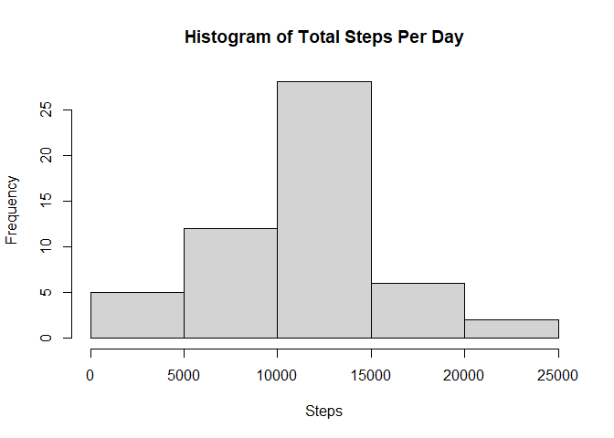
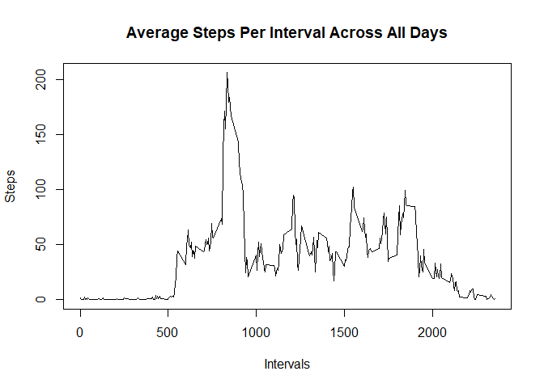
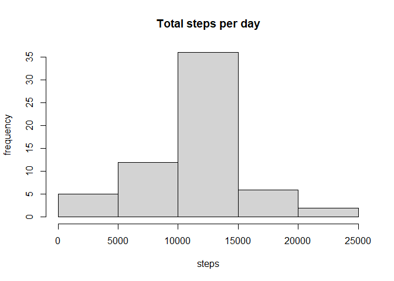
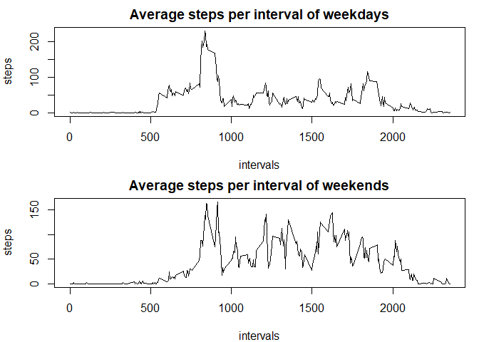

## Loading and preprocessing the data

```
## 
## Attaching package: 'dplyr'
```

```
## The following objects are masked from 'package:stats':
## 
##     filter, lag
```

```
## The following objects are masked from 'package:base':
## 
##     intersect, setdiff, setequal, union
```


## What is mean total number of steps taken per day?


```r
actperday <- act %>% group_by(date) %>% summarise(steps = sum(steps))
hist(actperday$steps, main = "Histogram of Total Steps Per Day", xlab='Steps', ylab="Frequency")
```

<!-- -->


```r
mean <- round(mean(actperday$steps, na.rm=TRUE))
mean
```

```
## [1] 10766
```

```r
median <- median(actperday$steps, na.rm=TRUE)
median
```

```
## [1] 10765
```
##### The mean of total steps per day is 1.0766\times 10^{4}, and the media is 10765.

## What is the average daily activity pattern?

```r
avgsteps <- act %>% group_by(interval) %>% summarise(steps = mean(steps, na.rm=TRUE))
with(avgsteps, plot(interval, steps, type = "l", main = "Average Steps Per Interval Across All Days", xlab="Intervals", ylab="Steps"))
```

<!-- -->


```r
high <- avgsteps[avgsteps$steps == max(avgsteps$steps), 1]
high<-high[[1]]
high
```

```
## [1] 835
```

##### The interval with highest average steps is 835.

## Imputing missing values


```r
missing <- length(is.na(act$steps))
missing
```

```
## [1] 17568
```

##### There are 17568 missing values


```r
#creating a new dataframe
newact <- act

#impute the missing values
for (i in c(1:length(act$steps))) {
  if (is.na(act$steps[i])==TRUE) {
    newact$steps[i] <- avgsteps[avgsteps$interval== act$interval[i], 2]
  }
newact
}

# making the histogram
grouped_data <- newact %>% group_by(date) %>% summarise(steps=sum(unlist(steps)))
hist(grouped_data$steps, main='Total steps per day', xlab='steps', ylab='frequency')
```

<!-- -->

```r
newmean <- mean(grouped_data$steps)
newmedian<-median(grouped_data$steps)
```
##### The new mean is 1.0766189\times 10^{4} and the new median is 10765, and the numbers are not the same. The impact is imputing the missing data makes the data more closer to the mean.


## Are there differences in activity patterns between weekdays and weekends?


```r
#adding the new column of weekdays and weekends
day<-weekdays(newact$date)
day<-which(day=='Saturday' | day == 'Sunday')
days <- rep("weekday", length(newact$date))
days[day] <- 'weekends'
new_data <- cbind(newact, days)
new_data$steps <- unlist(new_data$steps)

newact2 <- new_data %>% group_by(interval, days) %>% summarise(steps=mean(steps))
```

```
## `summarise()` has grouped output by 'interval'. You can override using the `.groups` argument.
```

```r
newact2 <- as.data.frame(newact2)

head(newact2)
```

```
##   interval     days      steps
## 1        0  weekday 2.25115304
## 2        0 weekends 0.21462264
## 3        5  weekday 0.44528302
## 4        5 weekends 0.04245283
## 5       10  weekday 0.17316562
## 6       10 weekends 0.01650943
```


```r
#making the plot


par(mfrow = c(2,1), mar = c(4,4,2,1))

plot(newact2[newact2$days=='weekday', 1], newact2[newact2$days=='weekday', 3], , type='l', main = 'Average steps per interval of weekdays', xlab = 'intervals', ylab='steps')

plot(newact2[newact2$days=='weekends', 1], newact2[newact2$days=='weekends', 3], , type='l', main = 'Average steps per interval of weekends', xlab = 'intervals', ylab='steps')
```

<!-- -->


